# IncidentForge

### Multi-Agent AI System for Production Incident Investigation

IncidentForge is a multi-agent engineering incident response system that investigates production incidents through a virtual team of specialized AI engineers.

Rather than relying on a single agent to diagnose an incident, IncidentForge decomposes the investigation across specialized engineering roles. Agents independently collect evidence from logs, metrics, traces, repositories, deployments, databases, and engineering documentation before contributing their findings to an Incident Commander.

The Incident Commander correlates evidence, evaluates competing hypotheses, resolves conflicting findings, and produces a root-cause assessment and remediation recommendation.

Built with **Python, Google ADK, Gemini, and Retrieval-Augmented Generation (RAG).**

---

## Overview

Production incidents rarely have a single obvious explanation.

A sudden increase in API latency could be caused by:

* a recent deployment
* database contention
* a downstream dependency
* infrastructure degradation
* configuration changes
* unusual traffic
* resource exhaustion
* a security event

Traditional monitoring systems can identify that something is wrong. IncidentForge focuses on determining **why it is happening** and **what should be done next**.

The system models incident response as a collaborative engineering workflow:

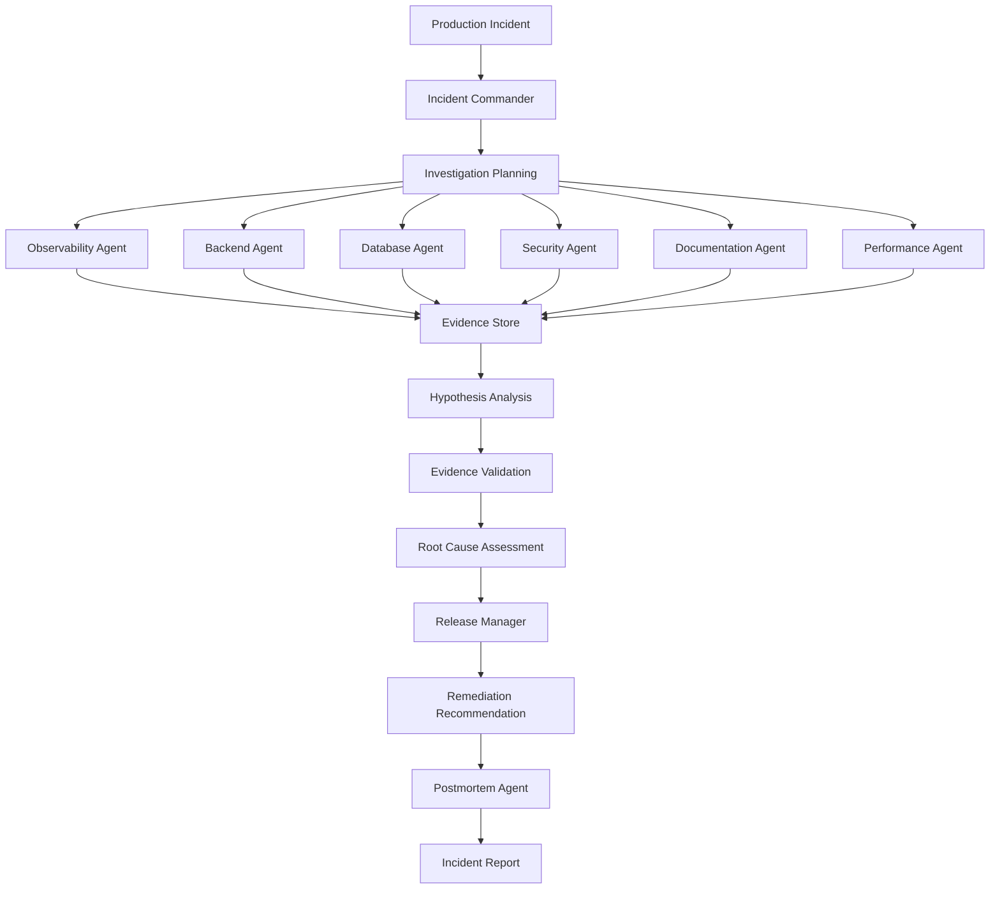

---

# Architecture

IncidentForge is organized around three major layers:

1. **Agent Layer** — specialized engineering roles
2. **Tool Layer** — interfaces to operational and engineering data
3. **Knowledge & State Layer** — shared evidence, hypotheses, and organizational knowledge

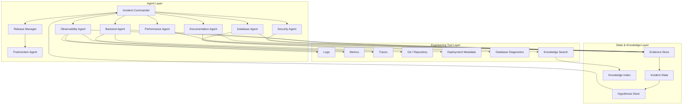

---

# Agent Team

IncidentForge models incident response as a team of specialized engineering roles. Each agent has a defined responsibility, toolset, and investigation perspective.

## Incident Commander

The Incident Commander is the coordinating agent responsible for managing the overall investigation.

Responsibilities include:

* understanding the incident and establishing severity
* decomposing the investigation into specialized tasks
* delegating tasks to appropriate agents
* maintaining shared incident state
* correlating findings from multiple agents
* identifying contradictory evidence
* ranking competing root-cause hypotheses
* determining when sufficient evidence has been collected
* coordinating remediation planning

The Incident Commander does not simply select the answer generated by another agent. It synthesizes evidence collected across the investigation.

---

## Observability Agent

Investigates the system through operational telemetry.

Analyzes:

* application logs
* service metrics
* distributed traces
* latency distributions
* error rates
* resource utilization
* service health

Its primary responsibility is determining **where abnormal behavior originates and how it propagates through the system**.

---

## Backend Agent

Investigates application-level behavior and recent software changes.

Analyzes:

* recent deployments
* Git commits
* code changes
* API behavior
* dependency changes
* application architecture

The Backend Agent can correlate an incident with a recently introduced application change.

---

## Database Agent

Investigates failures originating from the data layer.

Analyzes:

* query latency
* slow queries
* database resource utilization
* connection pools
* locks
* transaction behavior

An important responsibility is also **eliminating the database as a root-cause candidate when available evidence does not support that hypothesis**.

---

## Security Agent

Investigates security-related explanations for an incident.

Analyzes:

* abnormal traffic
* authentication failures
* suspicious request patterns
* rate limiting
* access anomalies
* security events

---

## Documentation Agent

Connects the current incident with existing organizational knowledge.

Uses retrieval-augmented generation to search:

* operational runbooks
* engineering documentation
* architecture documents
* previous incidents
* troubleshooting guides
* recovery procedures

Historical incidents can provide additional evidence when investigating a new failure.

---

## Performance Agent

Investigates system bottlenecks and performance regressions.

Analyzes:

* request critical paths
* service dependencies
* latency propagation
* downstream calls
* resource bottlenecks

The Performance Agent is particularly useful when multiple services appear healthy individually but the overall request path is degraded.

---

## Release Manager

Evaluates recovery strategies after a likely root cause has been established.

Potential strategies include:

* rollback
* feature-flag disablement
* configuration reversal
* controlled hotfix
* staged deployment

The Release Manager evaluates both recovery speed and operational risk before producing a recommendation.

---

## Postmortem Agent

Converts the investigation into a structured incident report.

The report includes:

* incident summary
* customer impact
* timeline
* evidence
* root cause
* contributing factors
* remediation
* preventive actions

---

# Agent Collaboration

The agents are not intended to behave as a simple sequence of prompts.

Each specialist investigates the incident independently and contributes structured findings to the shared investigation state.

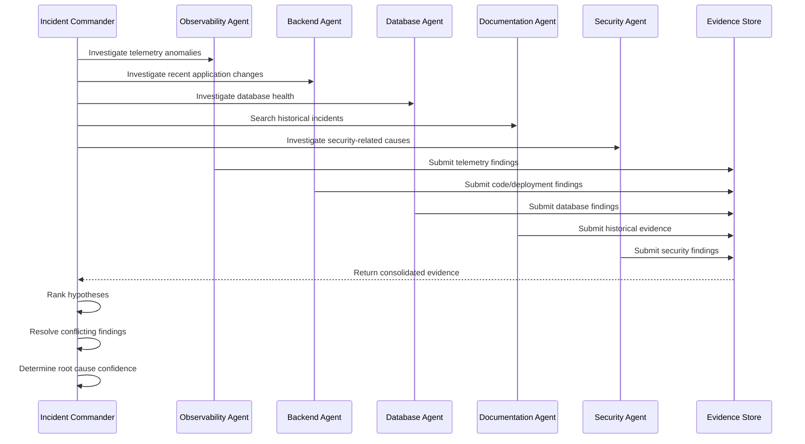

This allows the system to reason from **multiple independent perspectives** rather than relying on a single model response.

---

# Evidence-Driven Reasoning

A core design principle of IncidentForge is:

> **Agent conclusions are hypotheses; evidence is what determines confidence.**

Each agent contributes structured findings.

For example:

```text
Agent: Database Engineer

Finding:
Database query latency remained within normal limits.

Evidence:
Average query latency: 22 ms
Database CPU: 34%
Lock contention: None

Hypothesis:
Database degradation

Confidence:
Low
```

Another agent may report:

```text
Agent: Backend Engineer

Finding:
A synchronous inventory service call was introduced
during the latest checkout deployment.

Evidence:
Deployment: checkout-service v1.8.2
Commit: 8f31a2

Hypothesis:
Downstream inventory dependency causing request blocking

Confidence:
High
```

The Incident Commander uses these findings to update the relative confidence of competing hypotheses.

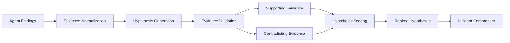

---

# Shared Incident State

The investigation maintains a shared state containing the information accumulated throughout the incident.

Conceptually:

```text
Incident State
│
├── Incident Metadata
│   ├── ID
│   ├── Severity
│   ├── Affected Services
│   └── Customer Impact
│
├── Agent Findings
│   ├── Observability
│   ├── Backend
│   ├── Database
│   └── Security
│
├── Evidence
│   ├── Logs
│   ├── Metrics
│   ├── Traces
│   └── Code Changes
│
├── Hypotheses
│   ├── Candidate Causes
│   ├── Confidence
│   └── Supporting Evidence
│
├── Rejected Hypotheses
│
└── Recommended Actions
```

This shared state allows later agents to build on earlier discoveries without losing the context of the investigation.

---

# Tool Architecture

Agents interact with engineering systems through specialized tools rather than directly accessing arbitrary data.

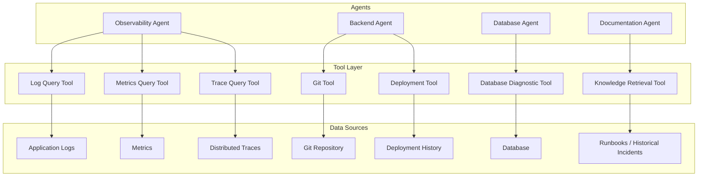

This abstraction allows simulated incident data to be used during development while keeping the architecture ready for real integrations.

---

# Retrieval-Augmented Generation

The Documentation Agent uses a knowledge layer to connect current incidents with previously documented engineering knowledge.

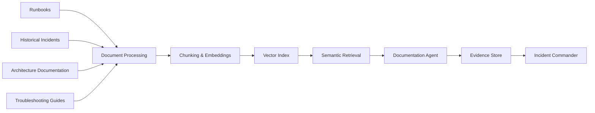

This enables IncidentForge to reason using both:

* current operational evidence
* historical organizational knowledge

---

# Incident Investigation Lifecycle

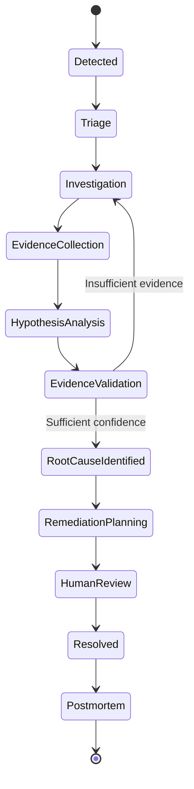

The investigation is therefore not necessarily linear. If evidence is insufficient or contradictory, the Incident Commander can request additional investigation before making a decision.

---

# Example Investigation

Consider an incident where checkout API latency increases from 120 ms to 4.5 seconds shortly after a deployment.

The agents might produce:

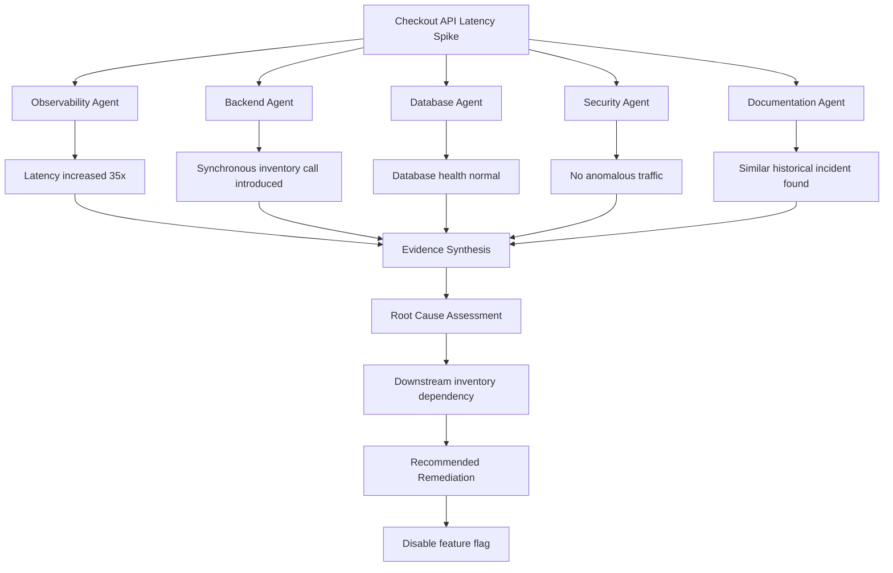

A resulting investigation summary could look like:

```text
Root Cause:
Synchronous inventory dependency introduced during
the latest checkout deployment.

Confidence:
91%

Supporting Evidence:
- Latency spike began immediately after deployment
- New synchronous inventory call detected
- Database health remained normal
- No anomalous traffic detected
- Similar historical incident identified

Recommended Action:
Disable inventory validation feature flag.

Follow-up:
Investigate asynchronous inventory validation and
add regression coverage.
```

---

# Evaluation

Agentic systems should be evaluated using repeatable scenarios rather than only qualitative demonstrations.

IncidentForge uses controlled incident scenarios to evaluate:

| Metric                   | Description                                          |
| ------------------------ | ---------------------------------------------------- |
| Root Cause Accuracy      | Whether the system identifies the underlying failure |
| Hypothesis Ranking       | Whether the correct cause is prioritized             |
| Evidence Quality         | Relevance of evidence used to support conclusions    |
| Remediation Accuracy     | Whether the recommended action is appropriate        |
| Investigation Efficiency | Investigation steps and tool usage                   |
| Confidence Calibration   | Whether confidence reflects available evidence       |

The evaluation suite covers incident categories such as:

* deployment regressions
* database failures
* downstream service outages
* configuration errors
* resource exhaustion
* memory leaks
* authentication failures
* network degradation

Evaluation scenarios are continuously expanded as new capabilities are introduced.

---

# Safety and Human Oversight

IncidentForge follows a **recommendation-first** approach.

The system can investigate incidents and evaluate potential recovery strategies, but destructive production actions are not executed without explicit authorization.

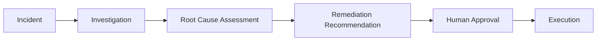

This separation makes the system suitable for gradually introducing automated remediation while maintaining human oversight.

---

# Google ADK

IncidentForge uses **Google Agent Development Kit (ADK)** as its agent orchestration framework.

The system is structured around:

* specialized agents
* agent delegation
* tool-based execution
* shared investigation state
* structured outputs
* modular workflows
* extensible agent teams

The architecture allows new engineering specialists to be introduced without redesigning the entire system.

For example:

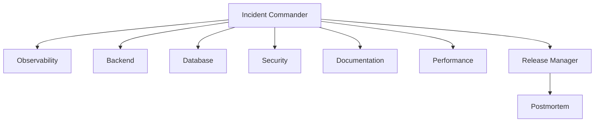

---

# Project Structure

```text
incidentforge/
│
├── agents/
│   ├── incident_commander/
│   ├── observability/
│   ├── backend/
│   ├── database/
│   ├── security/
│   ├── documentation/
│   ├── performance/
│   ├── release/
│   └── postmortem/
│
├── tools/
│   ├── observability/
│   ├── repository/
│   ├── database/
│   └── knowledge/
│
├── scenarios/
│   ├── payment_latency/
│   ├── database_failure/
│   └── service_outage/
│
├── knowledge_base/
│   ├── runbooks/
│   └── historical_incidents/
│
├── evaluation/
│
├── app/
│
├── requirements.txt
└── README.md
```

---

# Technology Stack

| Category            | Technology                      |
| ------------------- | ------------------------------- |
| Language            | Python                          |
| Agent Framework     | Google ADK                      |
| Foundation Model    | Gemini                          |
| Knowledge Retrieval | RAG + Vector Search             |
| Backend             | FastAPI                         |
| Observability       | Logs, Metrics, Traces           |
| Code Analysis       | Git / Repository Tools          |
| Interface           | Web UI                          |
| Evaluation          | Scenario-based Agent Evaluation |

---

# Development Roadmap

IncidentForge is designed as an extensible engineering platform. Development focuses on progressively increasing the depth of investigation, the breadth of engineering integrations, and the reliability of agent decisions.

### Agent Intelligence

* Dynamic investigation planning
* Multi-agent hypothesis debate
* Cross-agent contradiction detection
* Evidence confidence calibration
* Adaptive agent delegation

### Observability

* Prometheus integration
* OpenTelemetry traces
* Real-time log ingestion
* Service dependency graphs

### Engineering Integrations

* GitHub integration
* CI/CD integration
* Deployment metadata
* Issue and ticket creation
* Slack incident-room integration

### Knowledge

* Historical incident learning
* Runbook retrieval
* Architecture-aware retrieval
* Incident similarity search

### Remediation

* Approval-gated rollback
* Feature-flag management
* Diagnostic playbooks
* Human-in-the-loop remediation

### Evaluation

* Expanded incident benchmark
* Automated regression testing
* Agent cost and latency analysis
* Root-cause accuracy tracking

---

# Design Principles

### Specialization over Generalization

Each agent is responsible for a clearly defined engineering domain.

### Evidence over Opinions

Agent conclusions are treated as hypotheses and must be supported by evidence.

### Collaboration over Sequential Prompting

Agents contribute independent perspectives and can challenge competing hypotheses.

### Recommendation before Automation

The system separates investigation and recommendation from production execution.

### Continuous Evaluation

Agent behavior is measured using repeatable incident scenarios.

### Extensibility

New agents, tools, data sources, and incident scenarios can be introduced without changing the core architecture.

---

# Vision

IncidentForge aims to evolve from an incident investigation assistant into an AI engineering response team capable of supporting the complete incident lifecycle:

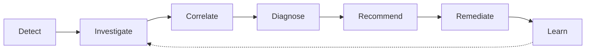

The architecture is designed so that each additional observability source, engineering integration, knowledge repository, or specialist agent expands the capabilities of the existing engineering team.

---

## Project Status

**Active Development**

IncidentForge is continuously evolving with new engineering agents, tools, integrations, incident scenarios, and evaluation capabilities.

The current architecture is intentionally modular to support incremental expansion without changing the underlying incident investigation workflow.

---

## Author

**Shalini Kashyap**

Computer Science & Engineering
